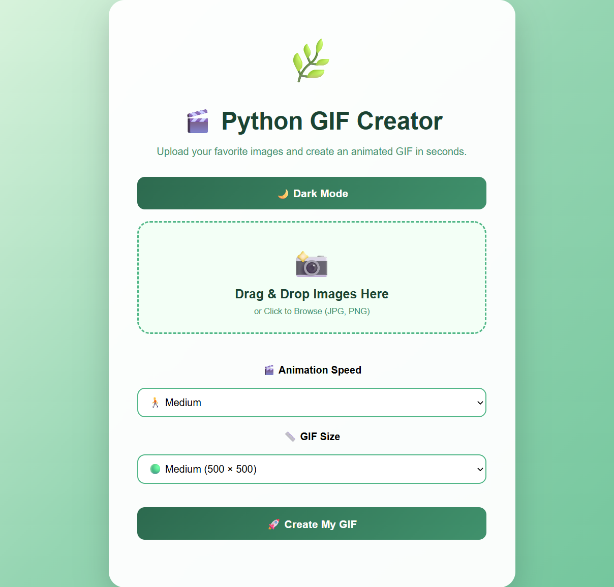
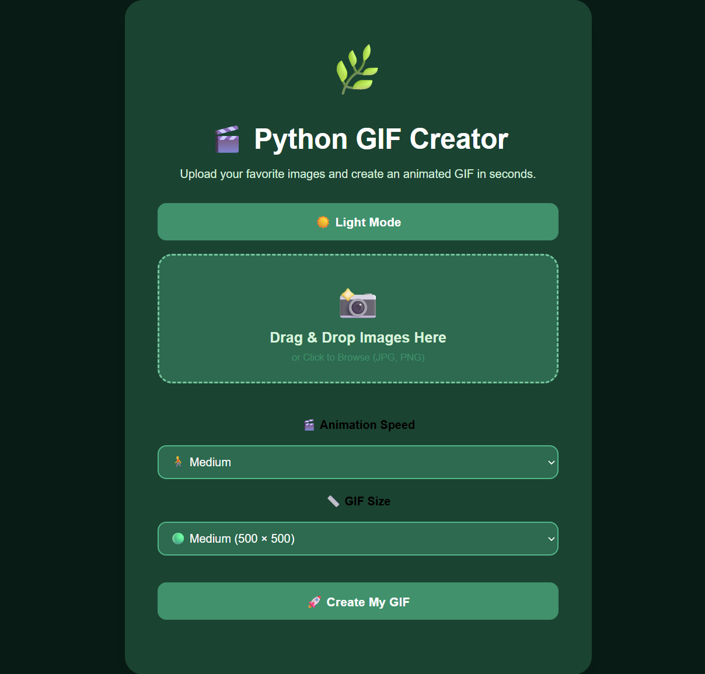
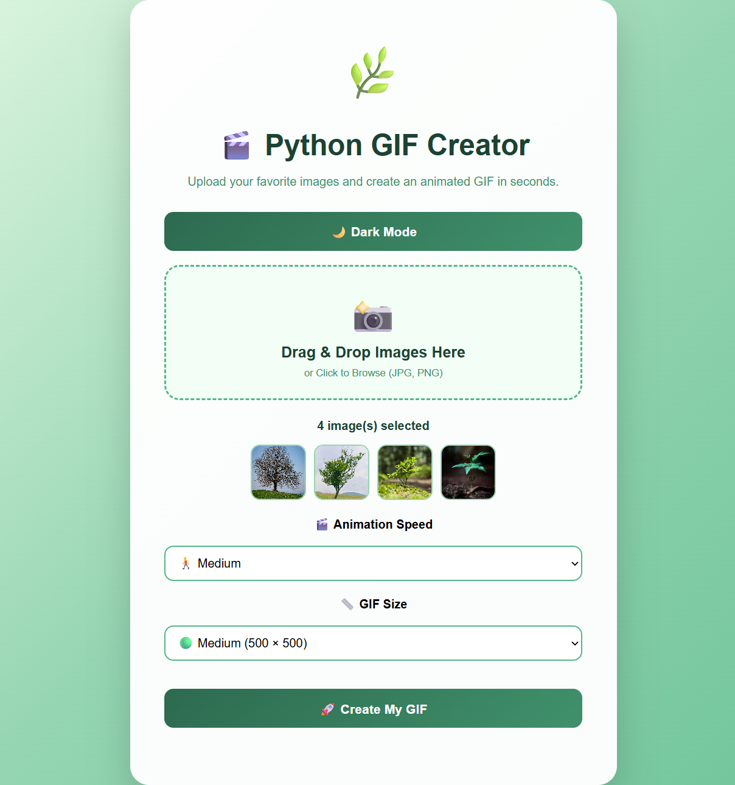

# 🌿 Python GIF Creator

A modern **Flask-based web application** that transforms multiple images into a high-quality animated GIF with an elegant, responsive interface.

> 📸 Upload Images • 🎬 Customize Speed • 📏 Choose GIF Size • 👀 Live Preview • ⬇️ Download Instantly

---

# ✨ Features

- 📸 Drag & Drop Upload
- 📁 Traditional File Picker (Desktop & Mobile)
- 🖼️ Live Image Preview
- 🎬 Adjustable GIF Speed
- 📏 Multiple GIF Size Options
- 🎞️ Instant GIF Preview
- ⬇️ One-click GIF Download
- 🌙 Dark Mode
- 📱 Fully Responsive Design
- 🗑️ Automatic Upload Cleanup
- ⚡ Fast GIF Generation

---

# 🎥 Live Demo

### Animated GIF


---

# 🖥️ Screenshots

### 🏠 Home Page



### 🌙 Dark Mode



### 📸 Image Preview



---

# 🚀 Tech Stack

| Technology | Purpose |
|------------|---------|
| Python | Backend |
| Flask | Web Framework |
| Pillow (PIL) | Image Processing |
| HTML5 | Structure |
| CSS3 | Styling |
| JavaScript | Frontend Interactivity |
| Git | Version Control |
| GitHub | Source Code Hosting |

---

# 📂 Project Structure

```text
python-gif-creator-web/
│
├── Assets/
│   ├── demo.gif
│   ├── home.png
│   ├── dark-mode.png
│   └── preview.png
│
├── static/
│   └── style.css
│
├── templates/
│   └── index.html
│
├── uploads/
├── output/
│
├── app.py
├── requirements.txt
├── .gitignore
└── README.md
```

---

# ⚙️ Installation

### 1️⃣ Clone the repository

```bash
git clone https://github.com/rituchowdhury425-ops/python-gif-creator-web.git
```

### 2️⃣ Open the project

```bash
cd python-gif-creator-web
```

### 3️⃣ Install dependencies

```bash
pip install -r requirements.txt
```

### 4️⃣ Start the application

```bash
python app.py
```

### 5️⃣ Open in your browser

```
http://127.0.0.1:5000
```

---

# 📖 How It Works

1. 📸 Upload one or more JPG/PNG images.
2. 👀 Preview the selected images.
3. 🎬 Select your preferred animation speed.
4. 📏 Choose the GIF size.
5. ✨ Click **Create GIF**.
6. 🎞️ Preview the generated animation.
7. ⬇️ Download your GIF.

---

# 🌱 Future Improvements

- ☁️ Deploy Online
- 🎨 Custom Background Colors
- 🖼️ GIF Filters
- 🖌️ Image Cropping
- 🎵 Audio Support
- 📦 ZIP Download
- 📱 Progressive Web App (PWA)

---

# 👩‍💻 Author

## Ritu Chowdhury

🎓 Artificial Intelligence & Machine Learning Student

🔗 GitHub

https://github.com/rituchowdhury425-ops

---

# ⭐ Support

If you found this project helpful, please consider giving it a ⭐ on GitHub.

It helps others discover the project and motivates me to build more open-source applications.

---

**Made with ❤️ using Python, Flask and Pillow**